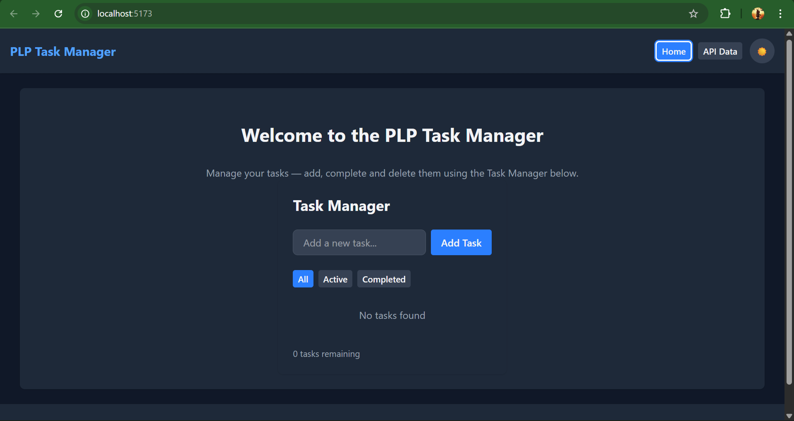
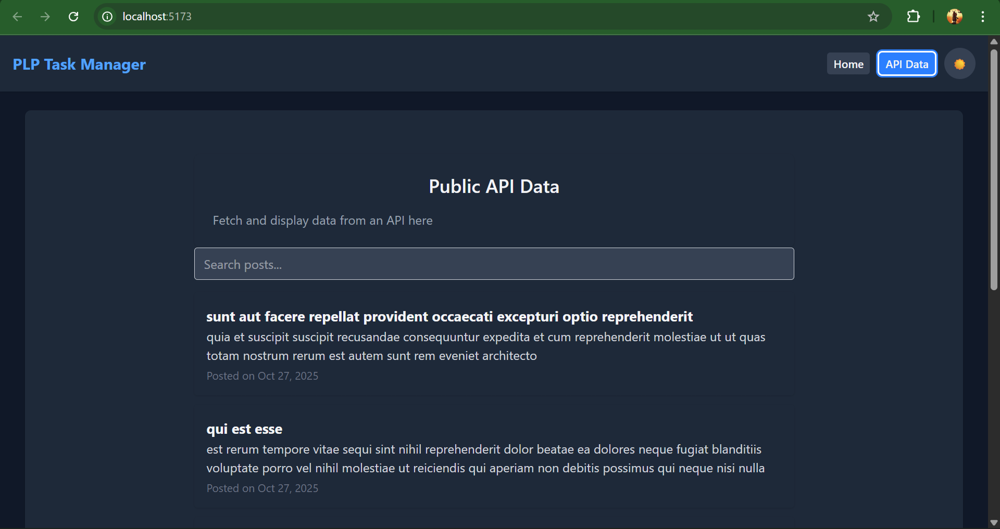

# React + Vite

This template provides a minimal setup to get React working in Vite with HMR and some ESLint rules.

Currently, two official plugins are available:

- [@vitejs/plugin-react](https://github.com/vitejs/vite-plugin-react/blob/main/packages/plugin-react) uses [Babel](https://babeljs.io/) (or [oxc](https://oxc.rs) when used in [rolldown-vite](https://vite.dev/guide/rolldown)) for Fast Refresh
- [@vitejs/plugin-react-swc](https://github.com/vitejs/vite-plugin-react/blob/main/packages/plugin-react-swc) uses [SWC](https://swc.rs/) for Fast Refresh

## React Compiler

The React Compiler is enabled on this template. See [this documentation](https://react.dev/learn/react-compiler) for more information.

Note: This will impact Vite dev & build performances.

## Expanding the ESLint configuration

If you are developing a production application, we recommend using TypeScript with type-aware lint rules enabled. Check out the [TS template](https://github.com/vitejs/vite/tree/main/packages/create-vite/template-react-ts) for information on how to integrate TypeScript and [`typescript-eslint`](https://typescript-eslint.io) in your project.


# React.js and Tailwind CSS Assignment

This assignment focuses on building a responsive React application using JSX and Tailwind CSS, implementing component architecture, state management, hooks, and API integration.

## Assignment Overview

You will:
1. Set up a React project with Vite and Tailwind CSS
2. Create reusable UI components
3. Implement state management using React hooks
4. Integrate with external APIs
5. Style your application using Tailwind CSS

## Getting Started

1. Accept the GitHub Classroom assignment invitation
2. Clone your personal repository that was created by GitHub Classroom
3. Install dependencies:
   ```
   npm install
   ```
4. Start the development server:
   ```
   npm run dev
   ```

# PLP Task Manager — React + Vite + Tailwind

This repository contains the Week 3 assignment: a small React application built with Vite and styled with Tailwind CSS. It demonstrates component architecture, hooks, context for theme management, and API integration.

---

## Table of contents

- Project overview
- Features
- Quick start
- Development
- Deployment
- Screenshots
- Troubleshooting
- Project structure
- License

---

## Project overview

This app is a simple Task Manager with:

- A TaskManager component (add/complete/delete/filter tasks)
- Theme switcher (light/dark) using React Context
- A small API page fetching posts from JSONPlaceholder

## Features

- Add, complete, and delete tasks (persisted in localStorage)
- Dark/light mode toggle (class-based)
- Simple client-side routing by toggling pages via context
- Tailwind CSS for styling

---

## Quick start

Requirements

- Node.js (v18+ recommended)
- npm

Install dependencies

```powershell
npm install
```

Start development server

```powershell
npm run dev
```

Build for production

```powershell
npm run build
```

Preview production build

```powershell
npm run preview
```

---

## Development notes

- The app's entry point is `src/main.jsx`.
- Global styles are in `src/index.css`. Tailwind is configured via `tailwind.config.js` (`darkMode: 'class'`).
- Theme context is in `src/context/ThemeContext.jsx` — it toggles the `.dark` class on `<html>`.
- Task persistence uses `src/hooks/useLocalStorage.js`.

Environment variables

- See `.env` for sample variables. For local development you typically don’t need to set anything unless integrating external APIs.

---

## Screenshots

Place three screenshots below (replace the placeholder paths with your screenshots in the repository):

1) Landing / Home view (With Tasks List)



2) API Data view



---

## Deployed URL

[Deployed app URL](https://react-js-jsx-and-css-masteri-git-88e709-stephen-henyas-projects.vercel.app)

---

## Troubleshooting

- Dark mode not applying? Ensure `tailwind.config.js` contains `darkMode: 'class'` and that the app toggles `document.documentElement.classList` (see `src/context/ThemeContext.jsx`). If dark styles don't appear, restart the dev server and hard-refresh the browser.
- If components don't show updated styles, check that `src/index.css` is imported in `src/main.jsx` and the Tailwind plugin is enabled in `vite.config.js`.

---

## Project structure

```
src/
├── api/               # API helper functions
├── components/        # Reusable UI components (Button, Navbar, Footer, TaskManager)
├── context/           # ThemeContext provider
├── hooks/             # Custom hooks (useLocalStorage)
├── pages/             # Page components (Home, ApiData)
├── utils/             # Small utilities
├── index.css          # Global styles
├── main.jsx           # App entry
└── App.jsx            # App layout
```

---

## License

This project is provided for educational purposes.

---